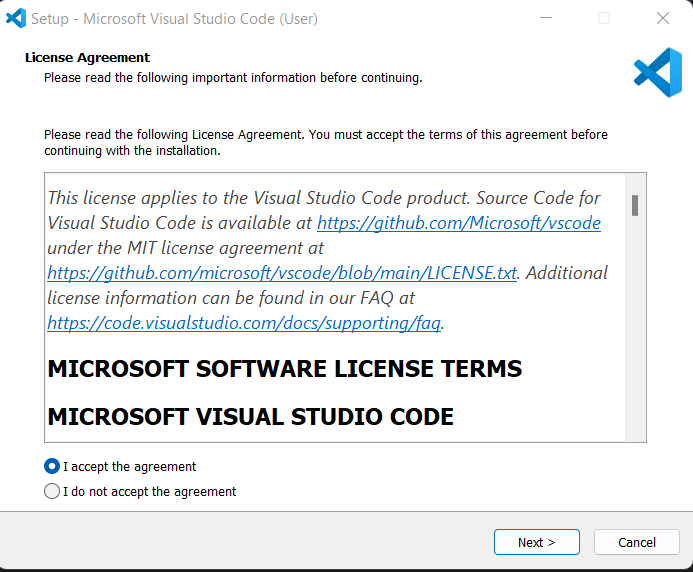
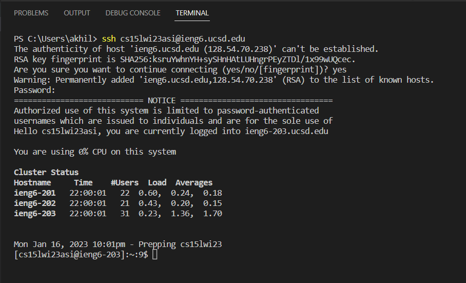
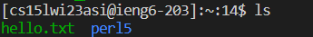

## Lab One

# Installing VScode
1. Go to [VScode Website](https://code.visualstudio.com/) and select "Download for windows"
* If you use macOS or Linux, then select the arrow next to "Download" and choose the version you need
2. When it finishes downloading the setup, open it and select "I agree" then next
* It should look like this 
3. Then choose next again, and then finish. It will then install and open VScode

# Remote Connecting
1. First open VScode, then at the top left, look for "Terminal". 
2. Select "Terminal" and then "New Terminal"
3. Type in "ssh cs15lwi23zz@ieng6.ucsd.edu" where the "zz" is replaced with the last three letters of your course specific account.
* For instance if your course specific account is "cs15lwi23bad" then you would type in "ssh cs15lwi23bad@ieng6.ucsd.edu"
* If you do not know what your course specific account is, go to [Link](https://sdacs.ucsd.edu/~icc/index.php) and log in
* Under "additional accounts" you should see a grey box with your course specific id
4. After typing this in the terminal, it will ask if you want to connect, and you should say yes
5. After accepting, it will ask for your password. Type in your ucsd student account password, and press enter
* Note- when typing the password in, nothing will show up in the terminal for privacy reasons.
6. You should then see something similar to this, informing you that you remotely connected:
* 

# Run some commands
1. Try a few commands in the terminal like "ls". This one will list the files in the directory
* Example: 
2. To find what the current directory path is, you can use the "pwd" command
3. You can change the director using "cd". For instance "cd  /home/linux/ieng6/cs15lwi23" and then "cd /home/linux/ieng6/cs15lwi23/xxxxxxxx" where the xxxxxs are replaced with your course ID
4. cp /home/linux/ieng6/cs15lwi23/public/hello.txt ~/ will copy the hello file to your home directory
* To see this, you can use the "ls" command
